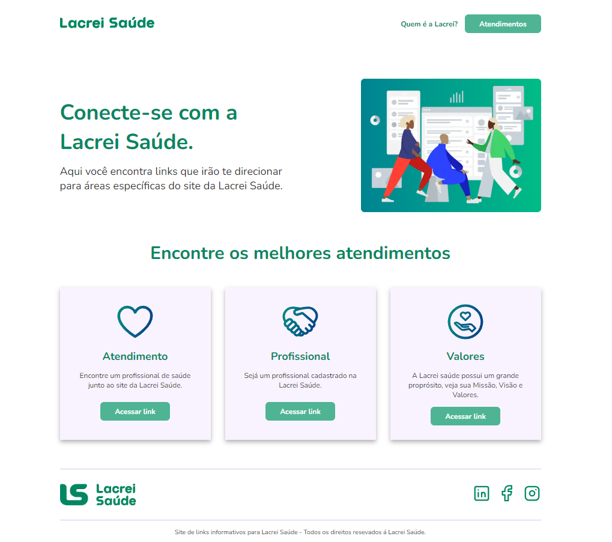
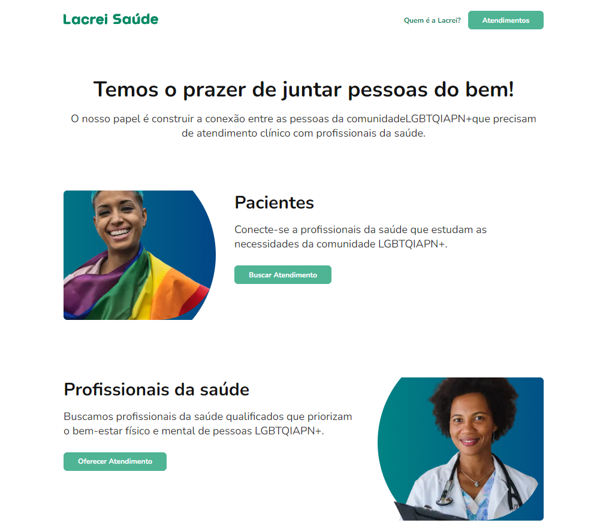

# Desafio Frontend Lacre Saúde |


> Projeto desenvolvido para Lacrei Saúde. Aplicação é uma de link que leva ao site Lacrei Saude desenvolvida em NextJs-14, nela é possivel visualizar os
> links que forma uma map do site principal.
> Utilizado técnicas de roteamento do proprio nextjs-14, onde é possivel navegar entrew paginas, ser direcionado para pagina da Lacrei Saude e seguido Style guide disponivel para o desafio técnico. Página encotra-se responsiva para aplicatiovs moveis e desktop.

## 100% Responsive

<div
  style="width:100%; display:flex; gap:16px, flex-wrap: wrap"
>


</div>


## Implantações do projeto

Desenvolva **duas páginas web interativas**, com roteamento entre elas, incorporando os seguintes elementos e mostrando toda sua criatividade para nós!

- **Header e Footer**: Designs que reflitam a essência acolhedora da Lacrei Saúde.
- **Três Botões**: Cada um com uma funcionalidade única, adicionando interatividade ao seu site e fazendo link com páginas da Lacrei Saúde.
- **Respeito ao Style Guide**: Utilize obrigatoriamente nosso guia de estilo para garantir que suas páginas não apenas brilhem, mas também mantenham a coesão visual da nossa marca.
- **Realizar um teste de sua escolha, demonstrar a responsividade e registrar seu processo no README.**
- **Fazer deploy da aplicação e enviar o link.**

- [x] - Desenvolva **duas páginas web interativas**, com roteamento entre elas, incorporando os seguintes elementos e mostrando toda sua criatividade para nós!.
- [x] - **Três Botões**: Cada um com uma funcionalidade única, adicionando interatividade ao seu site e fazendo link com páginas da Lacrei Saúde.
- [x] - **Header e Footer**: Designs que reflitam a essência acolhedora da Lacrei Saúde..
- [x] - **Respeito ao Style Guide**: Utilize obrigatoriamente nosso guia de estilo para garantir que suas páginas não apenas brilhem, mas também mantenham a coesão visual da nossa marca.
- [x] - **Realizar um teste de sua escolha, demonstrar a responsividade e registrar seu processo no README.**
- [x] - **Fazer deploy da aplicação e enviar o link.**.

## 💻 Como usar o projeto

<h3>Clone o repositorio</h3>

```bash
git clone https://github.com/Du-devBR/frontend-lacrei-saude
```

```bash
cd /lacrei-frontend
```

```bash
npm install
```

### Frontend
```bash
npm run dev
```

```bash
http://localhost:3000/
```

### 🛠 Tecnologias

As seguintes ferramentas foram usadas na construção do projeto:

- [NextJs](https://nextjs.org/)
- [Styled-components](https://styled-components.com/docs)
- [TypeScript](https://www.typescriptlang.org/)
